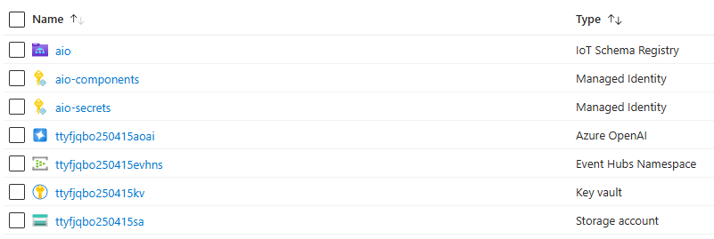
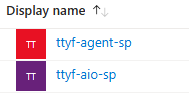
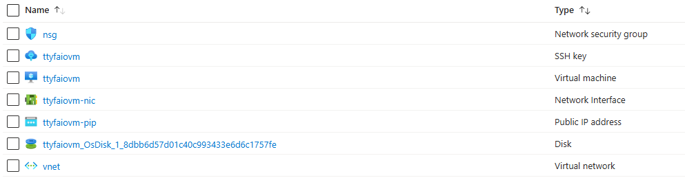
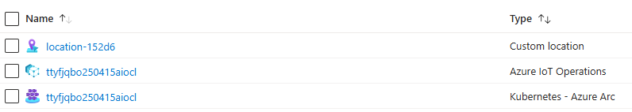

# Part 1 - Provision resources (Cloud & Edge)

## Prepare and provision Cloud Platform
You can choose between 2 options:  
- [Option 1](#option-1---automated-installation) : automated installation with `Ansible` (Infra as Code)
- [Option 2](#option-2---manual-installation) : manual installation using Azure CLI

### Option 1 - Automated installation
   - Download the file [`1_cloud-provision.yaml`](./artifacts/templates/deploy/1_cloud-provision.yaml)
   - Download the file [`variables_template.yaml`](./artifacts/templates/deploy/variables_template.yaml) and rename it to `variables.yaml`
   - Define variables in file `variables.yaml` to create Azure resources:
      ```bash
      SUBSCRIPTION_ID: ""                   # Id of your Azure subscription
      LOCATION: ""                          # Location (Azure region) where to create resources
      RESOURCE_GROUP: ""                    # Name of the Resource Group
      KEYVAULT_NAME: ""                     # Name of the Key Vault
      STORAGEACCOUNT_NAME: ""               # Name of the Storage Account. Length: 3-24. Valid Characters: lowercase letters and numbers.
      AIO_SERVICE_PRINCIPAL: ""             # Name of the Service Principal (service account) to manage Azure from the Edge Cluster, using Azure CLI (command-line interface)
      AIO_MANAGED_IDENTITY_SECRETS: ""      # Name of the Managed Identity for Azure IoT Operations secrets
      AIO_MANAGED_IDENTITY_COMPONENTS: ""   # Name of the Managed Identity for Azure IoT Operations components
      AIO_SCHEMA_REGISTRY_NAMESPACE: ""     # Name of the Schema Registry. Valid Characters: lowercase letters and numbers.
      AIO_CLUSTER_NAME: ""                  # Name of the Azure IoT Operations Cluster you want to deploy
      EVENTHUB_NAMESPACE: ""                # Name of the Event Hub Namespace
      EVENTHUB_NAME: ""                     # Name of the Event Hub inside the Event Hub Namespace
      FACTORY_AGENT_SERVICE_PRINCIPAL: ""   # Name of the Service Principal (service account) for the Factory Agent
      AZURE_OPENAI_NAME: ""                 # Name of the Azure Open AI service
      ```
   - Open a browser and navigate to the [Azure Portal](https://portal.azure.com/)
   - Use the [Azure Cloud Shell (**Bash**)](https://learn.microsoft.com/en-us/azure/cloud-shell/get-started/ephemeral?tabs=azurecli#start-cloud-shell)
   - Once the variables defined in file `variables.yaml`, upload the files `variables.yaml` and `1_cloud-provision.yaml` via `Manage files` > `Upload`.
   - Execute the playbook in Azure Cloud Shell to provision Azure Cloud resources
     ```bash
     ansible-playbook 1_cloud-provision.yaml
     ```
   - You should see the following when the playbook has finished successfully:
      
    
   - Now, open the `variables.yaml` file. It should contain additional information at the end (BEGIN/END ANSIBLE MANAGED BLOCK):
      ```bash
      # BEGIN ANSIBLE MANAGED BLOCK
      AIO_SP_APPID: ""
      AIO_SP_SECRET: ""
      AIO_SCHEMA_REGISTRY_ID: ""
      AIO_MANAGED_IDENTITY_SECRETS_ID: ""
      AIO_MANAGED_IDENTITY_COMPONENTS_ID: ""
      TENANT: ""
      ARC_OBJECT_ID: ""
      KEYVAULT_ID: ""
      FACTORY_AGENT_SP_APPID: ""
      FACTORY_AGENT_SP_SECRET: ""
      EVENTHUB_ID: ""
      EVENTHUB_KEY: ""
      # END ANSIBLE MANAGED BLOCK
      ```
   - Download the file `variables.yaml` via `Manage files` > `Download` > type `variables.yaml` > `Download`.
   - Copy the file `variables.yaml` to your Edge Cluster.

### Option 2 - Manual installation
   - Open a browser and navigate to the [Azure Portal](https://portal.azure.com/)
   - Use the [Azure Cloud Shell (**Bash**)](https://learn.microsoft.com/en-us/azure/cloud-shell/get-started/ephemeral?tabs=azurecli#start-cloud-shell)
   - Set Environment Variables for services to create in Azure:
     ```bash
     prefix="ttyf"
     random=$(tr -dc 'a-z' < /dev/urandom | fold -w 4 | head -n 1)$(date +%y%m%d)

     export TTYF_SUBSCRIPTION_ID="<YOUR_SUBSCRIPTION_ID>"
     export TTYF_LOCATION="<YOUR_LOCATION>"

     export TTYF_RESOURCE_GROUP="${prefix}-rg"
     export TTYF_KEYVAULT_NAME="${prefix}${random}kv"
     export TTYF_STORAGE_ACCOUNT_NAME="${prefix}${random}sa"     
     export TTYF_SCHEMA_REGISTRY_NAMESPACE="${prefix}${random}srns"
     export TTYF_SCHEMA_REGISTRY_NAME="aio"
     export TTYF_AIO_CLUSTER_NAME="${prefix}${random}aiocl"
     export TTYF_EVENTHUB_NAMESPACE="${prefix}${random}evhns"
     export TTYF_EVENTHUB_NAME="aio"
     export TTYF_AZURE_OPENAI_NAME="${prefix}${random}aoai"
     export TTYF_AZURE_OPENAI_DEPLOYMENT_NAME="talk-to-your-factory"
     export TTYF_AIO_SERVICE_PRINCIPAL="${prefix}-aio-sp"
     export TTYF_AIO_MI_SECRETS="aio-secrets"
     export TTYF_AIO_MI_COMPONENTS="aio-components"     
     export TTYF_FACTORY_AGENT_SERVICE_PRINCIPAL="${prefix}-agent-sp"
     ```
   - Select Azure Subscription:
     ```bash
     az account set --subscription $TTYF_SUBSCRIPTION_ID
     ```
#### Azure IoT Operations prerequisites
   - Register required Resource Providers (execute this step only once per subscription):
     ```bash
      az provider register -n "Microsoft.ExtendedLocation"
      az provider register -n "Microsoft.Kubernetes"
      az provider register -n "Microsoft.KubernetesConfiguration"
      az provider register -n "Microsoft.IoTOperations"
      az provider register -n "Microsoft.DeviceRegistry"
      az provider register -n "Microsoft.SecretSyncController"
     ```
   - Install Azure CLI extension for Azure IoT Operations:
     ```bash
      az extension add --upgrade --name azure-iot-ops
     ```
   - Create a Resource Group:
     ```bash
     az group create --location $TTYF_LOCATION --resource-group $TTYF_RESOURCE_GROUP --subscription $TTYF_SUBSCRIPTION_ID
     ```
   - Create a Managed Identity for Azure IoT Operations (components):
     ```bash
     az identity create --resource-group $TTYF_RESOURCE_GROUP --name $TTYF_AIO_MI_COMPONENTS
     ```
   - Create a Managed Identity for Azure IoT Operations (secrets):
     ```bash
     az identity create --resource-group $TTYF_RESOURCE_GROUP --name $TTYF_AIO_MI_SECRETS
     ```
   - Create a storage account with `hierarchical namespace enabled`:
     ```bash
     az storage account create --name $TTYF_STORAGE_ACCOUNT_NAME --resource-group $TTYF_RESOURCE_GROUP --enable-hierarchical-namespace
      ```
   - Create a schema registry that connects to your storage account:
     ```bash
     az iot ops schema registry create --name $TTYF_SCHEMA_REGISTRY_NAME --resource-group $TTYF_RESOURCE_GROUP --registry-namespace $TTYF_SCHEMA_REGISTRY_NAMESPACE --sa-resource-id $(az storage account show --name $TTYF_STORAGE_ACCOUNT_NAME --resource-group $TTYF_RESOURCE_GROUP -o tsv --query id)
     ```
   - Create a Key Vault:
     ```bash
     az keyvault create --enable-rbac-authorization false --name $TTYF_KEYVAULT_NAME --resource-group $TTYF_RESOURCE_GROUP
     ```
   - Assign 'Key Vault Secrets Officer' role to Managed Identity for Azure IoT Operations (secrets):
     ```bash
     az role assignment create --role "Key Vault Secrets Officer" --assignee $(az identity show --name $TTYF_AIO_MI_SECRETS --resource-group $TTYF_RESOURCE_GROUP --query principalId -o tsv) --scope $(az keyvault show --name $TTYF_KEYVAULT_NAME --resource-group $TTYF_RESOURCE_GROUP --query id -o tsv)
     ```  
#### Data Streaming Ingestion prerequisites
   - Create an Event Hub namespace:
     ```bash
     az eventhubs namespace create --name $TTYF_EVENTHUB_NAMESPACE --resource-group $TTYF_RESOURCE_GROUP --location $TTYF_LOCATION
     ```
   - Create an Event Hub:
     ```bash
     az eventhubs eventhub create --name $TTYF_EVENTHUB_NAME --resource-group $TTYF_RESOURCE_GROUP --namespace-name $TTYF_EVENTHUB_NAMESPACE
     ```
   - Create an Event Hub Consumer Group:
     ```bash
     az eventhubs eventhub consumer-group create --consumer-group-name "Fabric" --namespace-name $TTYF_EVENTHUB_NAMESPACE --eventhub-name $TTYF_EVENTHUB_NAME --resource-group $TTYF_RESOURCE_GROUP
     ```
   - Retrieve the Event Hub Connection String and create 2 variables:
     ```bash
     EVENTHUB_KEY_CREATE=$(az eventhubs namespace authorization-rule create --resource-group $TTYF_RESOURCE_GROUP --namespace-name $TTYF_EVENTHUB_NAMESPACE --name Listen --rights Listen)
     EVENTHUB_KEY_INFO=$(az eventhubs namespace authorization-rule keys list --resource-group $TTYF_RESOURCE_GROUP --namespace-name $TTYF_EVENTHUB_NAMESPACE --name Listen)
     export TTYF_EVENTHUB_KEY=$(echo $EVENTHUB_KEY_INFO | jq -r .primaryKey)
     ```
#### Factory Agent prerequisites
   - Create an Azure OpenAI resource:
     ```bash
     az cognitiveservices account create --name $TTYF_AZURE_OPENAI_NAME --resource-group $TTYF_RESOURCE_GROUP --location "swedencentral" --kind "OpenAI" --sku "S0" --subscription $TTYF_SUBSCRIPTION_ID
     ```
   - Deploy LLM in Azure OpenAI:
     ```bash
     az cognitiveservices account deployment create --resource-group $TTYF_RESOURCE_GROUP --name $TTYF_AZURE_OPENAI_NAME --deployment-name $TTYF_AZURE_OPENAI_DEPLOYMENT_NAME --model-name "gpt-4o-mini" --model-version "2024-07-18" --model-format "OpenAI" --sku-capacity "250" --sku-name "GlobalStandard"
     ```
   - Retrieve the Azure OpenAI resource keys and create 1 variable:
     ```bash
     export TTYF_AZURE_OPENAI_KEY=$(az cognitiveservices account keys list --name $TTYF_AZURE_OPENAI_NAME --resource-group $TTYF_RESOURCE_GROUP --query key1 --output tsv)
     ```
   - Create a service principal (service account) for the Factory Assistant:
     ```bash
     SPN_Factory_Agent=$(az ad sp create-for-rbac --name $TTYF_FACTORY_AGENT_SERVICE_PRINCIPAL)
     export TTYF_FACTORY_AGENT_SP_APPID=$(echo $SPN_Factory_Agent | jq -r .appId)
     export TTYF_FACTORY_AGENT_SP_SECRET=$(echo $SPN_Factory_Agent | jq -r .password)
     ```
#### Edge Gateway prerequisites
   - Create a service principal (service account) to manage Azure from the Edge Gateway running Azure IoT Operations:
     ```bash
     SPN_Edge=$(az ad sp create-for-rbac --name $TTYF_AIO_SERVICE_PRINCIPAL --role Contributor --scopes /subscriptions/$TTYF_SUBSCRIPTION_ID/resourceGroups/$TTYF_RESOURCE_GROUP)
     export TTYF_AIO_SP_APPID=$(echo $SPN_Edge | jq -r .appId)
     export TTYF_AIO_SP_SECRET=$(echo $SPN_Edge | jq -r .password)
     export TTYF_TENANT=$(echo $SPN_Edge | jq -r .tenant)
     ```
   - Assign role to the service principal `AIO_SP_APPID`
      ```bash
      az role assignment create --assignee $TTYF_AIO_SP_APPID --role "Role Based Access Control Administrator" --scope subscriptions/$TTYF_SUBSCRIPTION_ID/resourceGroups/$TTYF_RESOURCE_GROUP
      ```
   - Get `objectId` from `Microsoft Entra ID` for Azure Arc application and create 1 variable:
     ```bash
     export TTYF_ARC_OBJECT_ID=$(az ad sp show --id bc313c14-388c-4e7d-a58e-70017303ee3b --query id --output tsv)
     ```
      
#### Display the variables you created and keep a note of them for future use
```bash
printenv | grep TTYF_
```

#### Resources after provisioning
You should now see the following resources in Azure (names may vary depending on the variables you defined):  
   - Resource Group  
    
   - Entra ID  
    

## Prepare and provision Edge Cluster

- Hardware requirements
  - **Resources**:
      - CPU: `4 vCPU`
      - Memory: `16GB`
      - Storage: `30GB`

  - **Operating System**: the solution requires a Linux-based system, specifically a VM or physical machine running `Linux Ubuntu 24.04`. This system will perform as an Edge Cluster, handling queries directly from the production line and interfacing with other operational systems.

### Option A (Virtual Machine in Azure Cloud)
   - If you want to use a Virtual Machine in Azure, you can deploy it using the Deploy button below:  
      [](https://portal.azure.com/#create/Microsoft.Template/uri/https%3A%2F%2Fraw.githubusercontent.com%2Fchriscrcodes%2Fsmart-factory%2Frefs%2Fheads%2Fmain%2Fartifacts%2Ftemplates%2Fdeploy%2Fazure-vm.json)  
        
    - Fill the required information and click `Review + create` > `Create`
      > **Note**: `Standard_D4s_v3` is the recommended size for the Azure VM.
   - You should now see the following new resources in your Azure Resource Group (names may vary depending on the variables you defined):
    

### Option B (your own Industrial PC or Virtual Machine)
  - Install `Linux Ubuntu 24.04`

You can choose between 2 options:  
- [Option 1](#option-1---automated-installation-1) : automated installation with `Ansible` (Infra as Code)
- [Option 2](#option-2---manual-installation-1) : manual installation using Azure CLI

### Option 1 - Automated installation
- Copy the file `variables.yaml` to your Edge Cluster (in your home user directory)
- Login and execute the following commands on your Edge Cluster
    - Install `Ansible`:
      ```bash
      sudo apt update && sudo apt install ansible -y
      ```
    - Execute the playbook to install Azure IoT Operations to your Edge Cluster
      ```bash
      curl -O https://raw.githubusercontent.com/chriscrcodes/talk-to-your-factory/main/artifacts/templates/deploy/2_edge-install_aio.yaml
      ansible-playbook 2_edge-install_aio.yaml
      ```
      
      

### Option 2 - Manual installation
- Login and execute the following commands on your Ubuntu Machine
- Retrieve the following environment variables you noted earlier in [Cloud Part](#display-the-variables-you-created-and-keep-a-note-of-them-for-future-use) (result of `printenv` command), and paste them in the terminal (example below):
    ```bash
      TTYF_SCHEMA_REGISTRY_NAMESPACE=****
      TTYF_FACTORY_AGENT_SERVICE_PRINCIPAL=****
      TTYF_ARC_OBJECT_ID=d****
      TTYF_SCHEMA_REGISTRY_NAME=****
      TTYF_AIO_MI_COMPONENTS=****
    ...
    ```
- Install `curl` and `nano`:
     ```bash
     sudo apt update
     sudo apt install curl nano -y
     ```
- Install K3s
   - Run the `K3s installation script`:
     ```bash
     curl -sfL https://get.k3s.io | sh -
     ```
   - Create a `K3s configuration` file in `.kube/config`:
     ```bash
     mkdir ~/.kube
     sudo KUBECONFIG=~/.kube/config:/etc/rancher/k3s/k3s.yaml kubectl config view --flatten > ~/.kube/merged
     mv ~/.kube/merged ~/.kube/config
     chmod  0600 ~/.kube/config
     export KUBECONFIG=~/.kube/config
     kubectl config use-context default
     sudo chmod 644 /etc/rancher/k3s/k3s.yaml
     ```
   - Increase user watch/instance limits:
     ```bash
     echo fs.inotify.max_user_instances=8192 | sudo tee -a /etc/sysctl.conf
     echo fs.inotify.max_user_watches=524288 | sudo tee -a /etc/sysctl.conf
     sudo sysctl -p
     ```
   - Increase file descriptor limit:
     ```bash
     echo fs.file-max = 100000 | sudo tee -a /etc/sysctl.conf
     sudo sysctl -p
     ```
- Check K3s installation
  ```bash
  kubectl get node
  ```
- Install Azure prerequisites
  - Install `Azure CLI`:
    ```bash
    curl -sL https://aka.ms/InstallAzureCLIDeb | sudo bash
    ```
  - Install `Azure Arc extension`:
    ```bash
    az extension add --upgrade --name connectedk8s
    ```
  - Install `Azure IoT Operations extension`:
    ```bash
    az extension add --upgrade --name azure-iot-ops
    ```
- Validate Azure IoT Operations pre-deployment checks  
    - Before the deployment, use `az iot ops check` to execute IoT Operations pre-deployment checks.
      ```bash
      az iot ops check
      ```
    - If everything is OK, you can continue with the deployment. If not, please check the [Azure IoT Operations documentation](https://learn.microsoft.com/en-us/azure/iot-operations/deploy-iot-ops/howto-prepare-cluster?tabs=ubuntu) for more information.
- Install Azure IoT Operations
   - Connect to Azure using the service principal created in [Part 1 - Edge prerequisites](#edge-gateway-prerequisites)
     ```bash
     az login --service-principal --username $TTYF_AIO_SP_APPID --password $TTYF_AIO_SP_SECRET --tenant $TTYF_TENANT
     ```
   - Select Azure Subscription:
     ```bash
     az account set --subscription $TTYF_SUBSCRIPTION_ID
     ```
  - Connect Kubernetes Cluster to Azure via Azure Arc:
     ```bash
     az connectedk8s connect --name $TTYF_AIO_CLUSTER_NAME --location $TTYF_LOCATION --resource-group $TTYF_RESOURCE_GROUP --subscription $TTYF_SUBSCRIPTION_ID --enable-oidc-issuer --enable-workload-identity --disable-auto-upgrade
     ```
   - Get the cluster's issuer URL:
      ```bash
     OIDC_ISSUER_PROFILE=$(az connectedk8s show --resource-group $TTYF_RESOURCE_GROUP --name $TTYF_AIO_CLUSTER_NAME --query oidcIssuerProfile.issuerUrl --output tsv)
     sudo tee -a /etc/rancher/k3s/config.yaml <<EOF
      kube-apiserver-arg:
        - service-account-issuer=$OIDC_ISSUER_PROFILE
        - service-account-max-token-expiration=24h
      EOF
     ```
   - Enable Custom Location support:
     ```bash
     az connectedk8s enable-features --name $TTYF_AIO_CLUSTER_NAME --resource-group $TTYF_RESOURCE_GROUP --custom-locations-oid $TTYF_ARC_OBJECT_ID --features cluster-connect custom-locations
     ```
   - Restart K3s:
      ```bash
      sudo systemctl restart k3s
      ```
    - Check K3s installation
      ```bash
      kubectl get node
      ```
    - Initialize Azure IoT Operations foundations installation
      ```bash
      az iot ops init --subscription $TTYF_SUBSCRIPTION_ID --cluster $TTYF_AIO_CLUSTER_NAME --resource-group $TTYF_RESOURCE_GROUP
      ```
   - Deploy Azure IoT Operations:
       ```bash
       az iot ops create --add-insecure-listener --kubernetes-distro K3s --name $TTYF_AIO_CLUSTER_NAME --cluster $TTYF_AIO_CLUSTER_NAME --resource-group $TTYF_RESOURCE_GROUP --sr-resource-id /subscriptions/$TTYF_SUBSCRIPTION_ID/resourceGroups/$TTYF_RESOURCE_GROUP/providers/Microsoft.DeviceRegistry/schemaRegistries/$TTYF_SCHEMA_REGISTRY_NAME --broker-frontend-replicas 1 --broker-frontend-workers 1 --broker-backend-part 1 --broker-backend-workers 1 --broker-backend-rf 2 --broker-mem-profile Low
       ``` 
  - Confirm Azure IoT Operations installation  
      - After the deployment is complete, use `az iot ops check` to evaluate IoT Operations service deployment for health, configuration, and usability. The check command can help you find problems in your deployment and configuration.  
        > **Note**: confirm post deployment checks are green.   
        
        ```bash
        az iot ops check
        ```

### Resources after provisioning
  - You should now see the following new resources in your Azure Resource Group (names may vary depending on the variables you defined):
    

## Enable Data Streaming Ingestion
  - Azure - Authorize the cluster to connect to the Event Hub
     - Locate the Azure Event Hub name space you created in [Azure Portal](https://portal.azure.com/)
     - `Access Control (IAM)` > `Add` > `Add role assignment`
     - `Azure Event Hubs Data Sender` > `Next`
     - Assign access to `User, group, or service principal`
     - `Select Members` > type `azure-iot-operations-` to locate the `azure-iot-operations` extension  
       (For example: `/subscriptions/xxx/resourceGroups/xxx/providers/Microsoft.Kubernetes/connectedClusters/xxx/providers/Microsoft.KubernetesConfiguration/extensions/azure-iot-operations-xxx`)

## Azure IoT Operations - Create Data flows
  - Download the [Distributed State Store](https://learn.microsoft.com/en-us/azure/iot-operations/create-edge-apps/concept-about-state-store-protocol) tool
       ```bash
       curl -O https://raw.githubusercontent.com/chriscrcodes/talk-to-your-factory/main/artifacts/templates/azure-iot-operations/dataflows/dss/dss_set
       ``` 
  - Set the file as executable
       ```bash
       chmod +x ./dss_set
       ```
  - Download the Operators Dataset
       ```bash
       curl -O https://raw.githubusercontent.com/chriscrcodes/talk-to-your-factory/main/artifacts/templates/azure-iot-operations/dataflows/dss/operators.json
       ``` 
  - Download the Products Dataset
       ```bash
       curl -O https://raw.githubusercontent.com/chriscrcodes/talk-to-your-factory/main/artifacts/templates/azure-iot-operations/dataflows/dss/products.json
       ``` 
  - Import the operators dataset in the Distributed State Store
       ```bash
       ./dss_set --key operators --file "operators.json" --address localhost
       ```
  - Import the products dataset in the Distributed State Store
       ```bash
       ./dss_set --key products --file "products.json" --address localhost
       ```
  - Download the data flow  
     ```bash
     curl -O https://raw.githubusercontent.com/chriscrcodes/talk-to-your-factory/main/artifacts/templates/azure-iot-operations/dataflows/silver-to-cloud.yaml
    ```
  - Modify file with the name of the event hub name space created in [Step 1](#prepare-and-provision-cloud-platform) (`EVENTHUB_NAMESPACE` variable):
     ```bash
     sed -i 's/<EVENTHUB_NAMESPACE>/'"${EVENTHUB_NAMESPACE}"'/' silver-to-cloud.yaml
    ```
  - Modify file with the name of the event hub name created in [Step 1](#prepare-and-provision-cloud-platform) (`EVENTHUB_NAME` variable):
     ```bash
     sed -i 's/<EVENTHUB>/'"${EVENTHUB_NAME}"'/' silver-to-cloud.yaml
      ```
  - Deploy the cloud connector
     ```bash
     kubectl apply -f silver-to-cloud.yaml
     ```
  > **Note**: if you encounter an error "WARN[0000] Unable to read /etc/rancher/k3s/k3s.yaml", execute the following command:
    ```
    sudo chmod 644 /etc/rancher/k3s/k3s.yaml
    ```
 - Deploy the data flow (enrichment: bronze to silver)
   ```bash
   kubectl apply -f https://raw.githubusercontent.com/chriscrcodes/talk-to-your-factory/main/artifacts/templates/azure-iot-operations/dataflows/bronze-to-silver.yaml
   ```

## Deploy the MQTT Factory Data Simulator
  - Login and execute the following commands on your Ubuntu Machine
  - Factory Simulator
    ```bash
    kubectl apply -f https://raw.githubusercontent.com/chriscrcodes/talk-to-your-factory/main/artifacts/templates/k3s/pods/simulator/configuration.yaml
    kubectl apply -f https://raw.githubusercontent.com/chriscrcodes/talk-to-your-factory/main/artifacts/templates/k3s/pods/simulator/deployment.yaml
    ```
  - Deploy MQTT Client
    ```bash
    kubectl apply -f https://raw.githubusercontent.com/chriscrcodes/talk-to-your-factory/main/artifacts/templates/k3s/pods/mqtt-client/pod.yaml
    ```
  - Connect to the container running the MQTT client
    ```bash
    kubectl exec --stdin --tty mqtt-client -n azure-iot-operations -- sh
    ```
  - From within the container, launch the MQTT client:
    ```bash
    mqttui --broker mqtt://aio-broker-insecure:1883 --insecure
    ```
  - Confirm if the 2 following topics are present:
    - `LightningCars` (data coming from the Factory MQTT Simulator)
    - `Silver` (data coming from Azure IoT Operations 'bronze to silver' Data Flow)

    

## Confirm Data is flowing from Edge (Azure IoT Operations) to Cloud (Azure Event Hub)
  - Locate the Azure Event Hub Namespace you created in [Azure Portal](https://portal.azure.com/)
  - Data Explorer > select the event hub you created in [Step 1](#prepare-and-provision-cloud-platform) (`EVENTHUB_NAME` variable)
  - Click on `View events` and select a message on the right to confirm data flow is operational
  

- ✅ **You can now continue to** > [Part 2 - Configure the solution in Microsoft Fabric](./INSTALL-2.md)